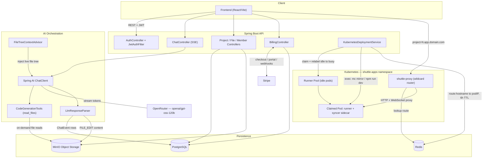
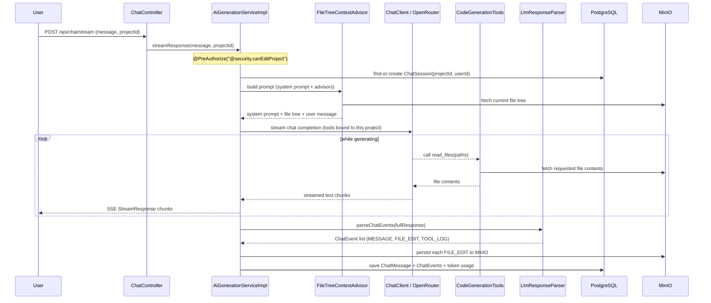
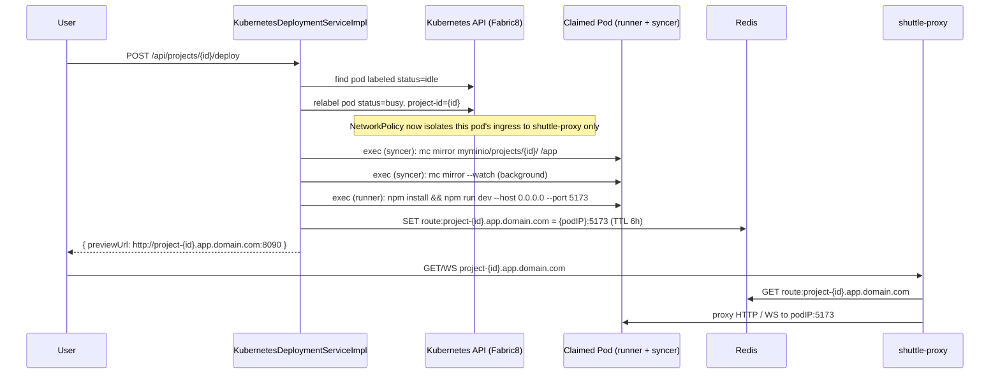
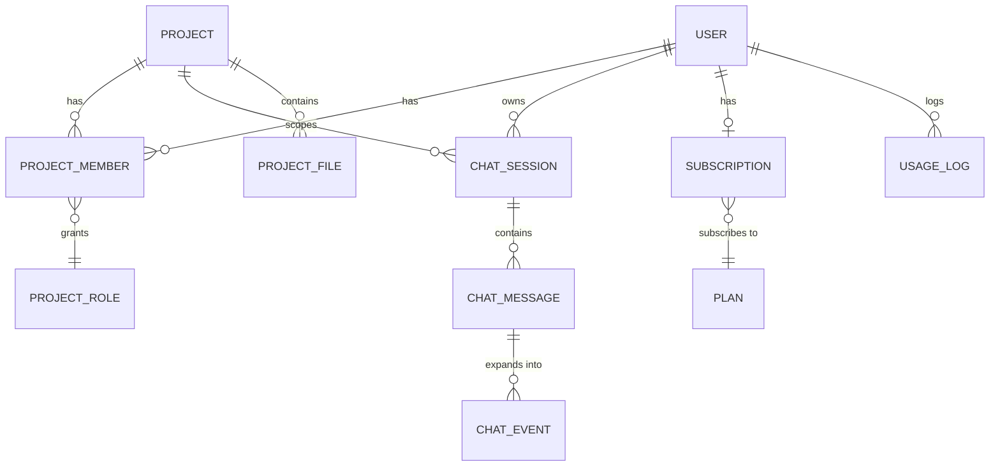

# AI-Driven Code Generation SaaS Platform
### A Distributed, AI-Powered Application Builder Platform

A Spring Boot backend for a Lovable/Bolt/v0-style product: users describe what they want in a chat interface, an LLM streams back a working React application, and every project gets its own **live, isolated, throwaway Kubernetes environment** with a real URL — powered by a custom-built pod pool, a Redis-backed wildcard reverse proxy, and MinIO-backed file storage.

This repository is the **application + platform layer**: authentication, AI orchestration, file persistence, real-time collaboration, subscription billing, and the container-orchestration system that turns a chat message into a running preview.


<!-- Add a screenshot or demo GIF of the chat + live preview experience here -->

---

## Table of Contents

- [Overview](#overview)
- [Architecture at a Glance](#architecture-at-a-glance)
- [Core Features](#core-features)
- [How It Works](#how-it-works)
  - [1. The AI Code-Generation Pipeline](#1-the-ai-code-generation-pipeline)
  - [2. Ephemeral Preview Infrastructure](#2-ephemeral-preview-infrastructure)
  - [3. Billing & Subscriptions](#3-billing--subscriptions)
  - [4. Collaboration & Access Control](#4-collaboration--access-control)
- [Tech Stack](#tech-stack)
- [Data Model](#data-model)
- [API Reference](#api-reference)
- [Project Structure](#project-structure)
- [Getting Started](#getting-started)
- [Configuration](#configuration)
- [Implementation Notes & Known Limitations](#implementation-notes--known-limitations)
- [Security Model](#security-model)
- [License](#license)

---

## Overview

Lovable Clone reproduces the core loop of modern AI app-builders:

1. A user creates a **project**, which is instantly seeded from a React/Vite/Tailwind/daisyUI starter template.
2. They describe a change in a chat panel. The backend streams the request to an LLM through **Spring AI**, augmented with the project's live file tree and an on-demand `read_files` tool so the model can inspect existing code before editing it.
3. The model's response — plain-text explanation, tool calls, and full file contents — is parsed out of a structured pseudo-XML protocol and persisted as file writes to **MinIO** and structured chat events in **PostgreSQL**.
4. When the user hits **Deploy**, the backend claims a pre-warmed pod from a **Kubernetes runner pool**, syncs the project's files into it via MinIO, boots a Vite dev server inside it, and registers a route in **Redis** so a custom wildcard reverse proxy can serve the live preview at `project-{id}.app.domain.com`.
5. Projects can be shared with collaborators under an **OWNER / EDITOR / VIEWER** permission model, and usage is metered and billed through **Stripe** subscriptions.

The result is a genuine multi-tenant, distributed system rather than a single monolithic demo — it combines conversational AI, agentic tool-calling, container orchestration, and SaaS billing in one codebase.

## Architecture at a Glance



## Core Features

- 🤖 **Conversational AI code generation** — streamed via Server-Sent Events, grounded in the project's real file tree, with the model able to call back into the backend to read files before editing them.
- ⚡ **Live, isolated preview environments** — every deploy claims a real Kubernetes pod running a live Vite dev server behind a dynamic wildcard subdomain, with WebSocket support for Vite's HMR.
- 📁 **Object-storage-backed file system** — project source files live in MinIO, addressed by `{projectId}/{path}`, with relational metadata in PostgreSQL.
- 🧬 **Template-based scaffolding** — new projects are cloned server-side (no download/re-upload round trip) from a shared `react-vite-tailwind-daisyui-starter` template bucket.
- 👥 **Team collaboration with RBAC** — invite collaborators as `OWNER`, `EDITOR`, or `VIEWER`, enforced through fine-grained permissions (`VIEW`, `EDIT`, `DELETE`, `MANAGE_MEMBERS`, `VIEW_MEMBERS`).
- 💳 **Full Stripe billing lifecycle** — Checkout Sessions, Customer Portal, and idempotent webhook handling for activation, upgrades, cancellation, renewal, and dunning (past-due) states.
- 📊 **Usage metering** — per-user daily token consumption is logged and checked against plan limits, with an `unlimitedAi` override tier.
- 🔒 **Stateless JWT authentication** — Spring Security with a custom filter chain and method-level `@PreAuthorize` SpEL authorization backed by a dedicated permission-evaluator bean.
- 🌐 **Custom wildcard reverse proxy** — a small Node.js service that resolves `project-N.app.domain.com` to a live pod IP via Redis and proxies both HTTP and WebSocket traffic.

## How It Works

### 1. The AI Code-Generation Pipeline

This is the most distinctive part of the system: a hand-built agentic loop on top of Spring AI's `ChatClient`, rather than a single request/response call to an LLM.



**Key building blocks:**

| Component | Role |
|---|---|
| `PromptUtils.CODE_GENERATION_SYSTEM_PROMPT` | A detailed system prompt enforcing a strict **Analyze → Plan → Execute → Stop** protocol, a custom XML-like output format (`<message phase="...">`, `<file path="...">`, `<tool args="...">`), an **atomic-update rule** (each file path may appear at most once per response), and explicit anti-"AI slop" design direction (no default fonts/purple gradients, semantic Tailwind/daisyUI classes only, strict TypeScript, 100–150 line file limits). |
| `FileTreeContextAdvisor` | A custom Spring AI `StreamAdvisor` that intercepts every request, pulls the live file tree for the project out of the request context, and injects it as an additional system message immediately before the user's message. |
| `CodeGenerationTools` | A per-request `@Tool`-annotated bean exposing `read_files(paths)` to the model, pre-bound to the current `projectId` so the model never has to supply it. |
| `LlmResponseParser` | Regex-based parser (`<(message\|file\|tool)...>...</\2>`) that converts the raw streamed response into typed `ChatEvent` rows once the stream completes. |
| `ChatEventType.THOUGHT` | Not parsed from the model's output — synthesized directly from response timing (time to first token), giving the UI a "Thought for Ns" indicator. |

The model is accessed through Spring AI's OpenAI-compatible client, but pointed at **OpenRouter** (`openai/gpt-oss-120b:free`) rather than OpenAI directly, at `temperature: 0.0` for maximally deterministic, parseable output.

### 2. Ephemeral Preview Infrastructure

This is a small, self-built PaaS. Instead of provisioning a container on demand (slow), a **pool of pre-warmed idle pods** sits ready in Kubernetes and gets *claimed* the moment a project is deployed.



**Key building blocks:**

| Component | Role |
|---|---|
| `runner-pool` Deployment | 2 replicas, each pod containing a `runner` container (`node:20-alpine`, idle via `sleep infinity` until claimed) and a `syncer` sidecar (`minio/mc`) sharing an `emptyDir` workspace volume, plus a `hostPath`-mounted `pnpm-store` cache volume. |
| Label-driven claiming | Claiming a pod is a metadata mutation (`status: idle → busy`, `project-id: {id}`) — no pod restart or rescheduling involved. |
| `NetworkPolicy: isolate-project-pods` | Automatically restricts ingress on any `status: busy` pod to the `shuttle-proxy` pod on port 5173, and allows unrestricted egress (so `npm install` can reach the registry). Tenant isolation falls directly out of Kubernetes labels — no bespoke firewalling code in the app. |
| `shuttle-proxy` | A standalone Node.js service (`http-proxy` + `ioredis`) that terminates all preview traffic, strips the port from the `Host` header, looks up `route:{hostname}` in Redis, and proxies both plain HTTP requests and WebSocket upgrades (required for Vite's HMR) to the resolved pod IP. |
| Redis routing table | `route:{hostname} → {podIP}:5173`, with a **6-hour TTL** per deploy. |

### 3. Billing & Subscriptions

A complete Stripe integration: Checkout for new subscriptions, the Billing Portal for self-service management, and a webhook handler covering the full subscription lifecycle.

- **Checkout** (`POST /api/payments/checkout`) creates a Stripe Checkout Session in subscription mode, reusing an existing `stripeCustomerId` when one exists (falling back to `customer_email` on first purchase), and stamps `user_id`/`plan_id` into session metadata for later webhook correlation.
- **Webhook handling** (`POST /webhooks/payment`) verifies the Stripe signature, safely deserializes the event (with a raw-JSON fallback path if the SDK's typed deserialization comes back empty), and dispatches on event type:
  - `checkout.session.completed` → activates the subscription (idempotent — checks `existsByStripeSubscriptionId` first so webhook retries can't create duplicates).
  - `customer.subscription.updated` → diff-based update; only writes to the database if status, period dates, `cancelAtPeriodEnd`, or plan actually changed.
  - `customer.subscription.deleted` → marks the subscription `CANCELED`.
  - `invoice.paid` → renews the current billing period and reactivates a `PAST_DUE`/`INCOMPLETE` subscription.
  - `invoice.payment_failed` → marks the subscription `PAST_DUE`.
- **Plan enforcement**: `canCreateNewProject()` checks the caller's owned-project count against their plan's `maxProjects`, falling back to a **100-project free tier** when no paid plan exists.

### 4. Collaboration & Access Control

Projects are shared through a `ProjectMember` join entity keyed on `(projectId, userId)`. Each membership carries a `ProjectRole`:

| Role | Permissions |
|---|---|
| `OWNER` | `VIEW`, `EDIT`, `DELETE`, `MANAGE_MEMBERS`, `VIEW_MEMBERS` |
| `EDITOR` | `VIEW`, `EDIT`, `DELETE`, `VIEW_MEMBERS` |
| `VIEWER` | `VIEW`, `VIEW_MEMBERS` |

Authorization is enforced declaratively with Spring Security's `@PreAuthorize`, delegating to a dedicated `@Component("security")` bean (`SecurityExpressions`) exposed to SpEL as `@security.canEditProject(#projectId)`, `@security.canManageMembers(#projectId)`, etc. — rather than Spring Security's built-in `GrantedAuthority` model, which is intentionally left empty on `User`.

## Tech Stack

| Layer | Technology |
|---|---|
| **Language / Runtime** | Java 21 |
| **Framework** | Spring Boot 4.0.0 (`spring-boot-starter-webmvc`, `-data-jpa`, `-security`, `-validation`, `-data-redis`) |
| **AI Orchestration** | Spring AI 2.0.0-M1 (`ChatClient`, `StreamAdvisor`, `@Tool` function calling) via an OpenAI-compatible client pointed at **OpenRouter** (`openai/gpt-oss-120b:free`) |
| **Database** | PostgreSQL (pgvector-enabled image), Hibernate/JPA (`ddl-auto: update`) |
| **Object Storage** | MinIO (S3-compatible), via the official `minio` Java SDK |
| **Cache / Routing** | Redis (`StringRedisTemplate`), also used as the reverse-proxy routing table |
| **Container Orchestration** | Kubernetes, via the Fabric8 `kubernetes-client` (pod exec, label mutation, pod listing) |
| **Reverse Proxy** | Standalone Node.js service (`http-proxy`, `ioredis`) |
| **Payments** | Stripe (`stripe-java`) — Checkout, Billing Portal, Webhooks |
| **Auth** | Stateless JWT (`jjwt`), BCrypt password hashing, Spring Security method security |
| **Object Mapping** | MapStruct 1.6.3, Lombok (`@RequiredArgsConstructor`, `@FieldDefaults`, `@Builder`) |
| **Build** | Maven |
| **Generated-app stack** | React 18, TypeScript, Vite, Tailwind CSS 4, daisyUI 5 (enforced by the AI system prompt) |

## Data Model

The core entities and their relationships:



| Entity | Notes |
|---|---|
| `User` | Implements Spring Security's `UserDetails`; `getAuthorities()` intentionally returns an empty list since authorization runs through the custom permission model instead. |
| `Project` | Soft-deleted (`deletedAt`); composite indexes on `(updatedAt DESC, deletedAt)` support the "recently updated" project listing. |
| `ProjectMember` | Composite key `(projectId, userId)` — a user's membership *is* their identity within a project; there is no separate surrogate membership ID. |
| `ChatSession` | Composite key `(projectId, userId)` — one chat thread per user per project, not a single shared project-wide thread. |
| `ChatMessage` | `content` is populated for `USER` messages; for `ASSISTANT` messages the real detail lives in child `ChatEvent` rows instead. |
| `ChatEvent` | One row per parsed protocol tag (`MESSAGE`, `FILE_EDIT`, `TOOL_LOG`) plus one synthesized `THOUGHT` row per assistant turn, ordered by `sequenceOrder`. |
| `ProjectFile` | Relational metadata only — `minioObjectKey` points at the actual blob in MinIO. |
| `Plan` / `Subscription` / `UsageLog` | Model plan limits (`maxProjects`, `maxTokensPerDay`, `unlimitedAi`), the user's current Stripe-backed subscription, and per-user-per-day token counters (unique on `(user_id, date)`). |
| `Preview` | Models a live sandbox (namespace, pod name, preview URL, status, timestamps) — see [Known Limitations](#implementation-notes--known-limitations) regarding its persistence. |

## API Reference

All endpoints are prefixed by the paths shown; none share a global `/api` root `@RequestMapping` at the application level. Endpoints marked **Public** are covered by `WebSecurityConfig`'s `permitAll()` matchers (`/api/auth/**`, `/webhooks/**`); everything else requires a valid `Authorization: Bearer <jwt>` header.

### Auth — `/api/auth`

| Method | Path | Description | Auth |
|---|---|---|---|
| POST | `/api/auth/signup` | Create an account, return a JWT | Public |
| POST | `/api/auth/login` | Authenticate, return a JWT | Public |
| GET | `/api/auth/me` | Current user's profile | Public* |

<sub>*`/api/auth/**` is a blanket public matcher, so `/me` is currently reachable without a token — see [Known Limitations](#implementation-notes--known-limitations).</sub>

### Projects — `/api/projects`

| Method | Path | Description |
|---|---|---|
| GET | `/api/projects` | List projects the caller can access, with their role on each |
| GET | `/api/projects/{id}` | Get a single project summary |
| POST | `/api/projects` | Create a project (enforces plan limits, seeds from template) |
| PATCH | `/api/projects/{id}` | Rename a project |
| DELETE | `/api/projects/{id}` | Soft-delete a project |
| POST | `/api/projects/{id}/deploy` | Claim a runner pod and return a live preview URL |

### Files — `/api/projects/{projectId}/files`

| Method | Path | Description |
|---|---|---|
| GET | `/api/projects/{projectId}/files` | Get the project's file tree |
| GET | `/api/projects/{projectId}/files/content?path=` | Get a single file's content |

### Chat — `/api/chat`

| Method | Path | Description |
|---|---|---|
| POST | `/api/chat/stream` | Send a message, stream the AI response via SSE |
| GET | `/api/chat/projects/{projectId}` | Get the caller's chat history for a project |

### Members — `/api/projects/{projectId}/members`

| Method | Path | Description |
|---|---|---|
| GET | `/api/projects/{projectId}/members` | List project members |
| POST | `/api/projects/{projectId}/members` | Invite a member by username, with a role |
| PATCH | `/api/projects/{projectId}/members/{memberId}` | Change a member's role |
| DELETE | `/api/projects/{projectId}/members/{memberId}` | Remove a member |

### Billing & Usage

| Method | Path | Description | Auth |
|---|---|---|---|
| GET | `/api/plans` | List active plans | Required |
| GET | `/api/me/subscription` | Current user's subscription | Required |
| POST | `/api/payments/checkout` | Create a Stripe Checkout session | Required |
| POST | `/api/payments/portal` | Create a Stripe Billing Portal session | Required |
| POST | `/webhooks/payment` | Stripe webhook receiver | Public (signature-verified) |
| GET | `/api/usage/today` | Today's token/preview usage | Required |

## Project Structure

The Java sources follow standard Maven/package conventions and can be reconstructed directly from each file's `package` declaration:

```
src/main/java/com/codingshuttle/projects/lovable_clone/
├── config/          # AiConfig, CorsConfig, KubernetesConfig, PaymentConfig, RedisConfig, StorageConfig
├── controller/       # AuthController, BillingController, ChatController,
│                     # FileController, ProjectController, ProjectMemberController, UsageController
├── dto/
│   ├── auth/ chat/ deploy/ member/ project/ subscription/
├── entity/          # JPA entities (Project, User, ChatSession, ChatMessage, ChatEvent,
│                     # ProjectFile, ProjectMember(+Id), Plan, Subscription, UsageLog, Preview)
├── enums/           # ChatEventType, MessageRole, PreviewStatus, ProjectPermission, ProjectRole, SubscriptionStatus
├── error/           # ApiError, BadRequestException, ResourceNotFoundException, GlobalExceptionHandler
├── llm/
│   ├── advisors/    # FileTreeContextAdvisor
│   ├── tools/       # CodeGenerationTools
│   ├── LlmResponseParser.java
│   └── PromptUtils.java
├── mapper/          # MapStruct interfaces (Chat, ProjectFile, Project, ProjectMember, Subscription, User)
├── repository/      # Spring Data JPA repositories
├── security/         # AuthUtil, JwtAuthFilter, JwtUserPrincipal, SecurityExpressions, WebSecurityConfig
└── service/
    └── impl/        # Service implementations
src/main/resources/
└── application.yml
pom.xml
```

The infrastructure layer (Kubernetes manifests and the proxy service) is a separate deployable unit; the structure below is a conventional layout for organizing what's described in this document — adapt it to match your actual repository layout:

```
k8s/
├── namespace.yaml              # shuttle-apps namespace
├── minio-external-service.yaml # ExternalName bridge to host.docker.internal:9011
├── redis.yaml                  # redis-server Deployment + redis-service
├── network-policy.yaml         # isolate-project-pods
├── runner-pool.yaml            # runner-pool Deployment (runner + syncer containers)
└── shuttle-proxy.yaml          # shuttle-proxy Deployment + LoadBalancer Service

shuttle-proxy/
├── index.js                    # wildcard HTTP/WS reverse proxy
└── package.json
```

## Getting Started

### Prerequisites

- Java 21 and Maven
- Docker & Docker Compose
- A local Kubernetes cluster (e.g., Docker Desktop's built-in Kubernetes) with `kubectl` configured — required because the MinIO bridge service targets `host.docker.internal`
- Node.js (to run/build the `shuttle-proxy` service)
- A Stripe account (test mode) and an OpenRouter API key

### 1. Start stateful dependencies

PostgreSQL and MinIO run via Docker Compose:

```yaml
# docker-compose.yml
services:
  pgvector:
    image: pgvector/pgvector:0.8.1-pg18-trixie
    environment:
      POSTGRES_DB: pgvector-test
      POSTGRES_USER: user
      POSTGRES_PASSWORD: password
    ports: ["9010:5432"]
    volumes: ["pgvector-data:/var/lib/postgresql"]

  minio:
    image: quay.io/minio/minio:latest
    command: server /data --console-address ":9001"
    environment:
      MINIO_ROOT_USER: minioadmin
      MINIO_ROOT_PASSWORD: minioadmin123
    ports: ["9011:9000", "9012:9001"]
    volumes: ["minio-data:/data"]

volumes:
  minio-data:
  pgvector-data:
```

```bash
docker compose up -d
```

Then, via the MinIO console (`localhost:9012`) or `mc`, create two buckets:
- `projects` — holds all live project files
- `starter-projects` — holds the `react-vite-tailwind-daisyui-starter/` template that new projects are cloned from

> The application does not create these buckets automatically — they must exist before the first project is created or deployed.

### 2. Stand up the Kubernetes resources

```bash
kubectl apply -f k8s/namespace.yaml
kubectl apply -f k8s/minio-external-service.yaml
kubectl apply -f k8s/redis.yaml
kubectl apply -f k8s/network-policy.yaml
kubectl apply -f k8s/runner-pool.yaml

# Build and deploy the wildcard proxy
cd shuttle-proxy && docker build -t shuttle-proxy:latest . && cd ..
kubectl apply -f k8s/shuttle-proxy.yaml
```

### 3. Configure the application

Set the following (via `application.yml`, environment variables, or a `.env` mechanism of your choice — do not commit real secrets):

| Key | Purpose |
|---|---|
| `spring.datasource.url/username/password` | PostgreSQL connection (`localhost:9010` per the compose file above) |
| `spring.ai.openai.api-key` / `base-url` / `chat.options.model` | LLM provider — configured for OpenRouter and `openai/gpt-oss-120b:free` by default |
| `minio.url` / `access-key` / `secret-key` / `project-bucket` | MinIO connection |
| `jwt.secret-key` | HMAC signing key for access tokens |
| `stripe.api.secret` / `stripe.webhook.secret` | Stripe API + webhook signing secrets (test mode) |
| `client.url` | Frontend origin used for Stripe redirect/return URLs |

### 4. Run the backend

```bash
./mvnw spring-boot:run
```

### 5. Run the proxy (if not running it in-cluster)

```bash
cd shuttle-proxy
npm install
REDIS_URL=redis://localhost:6379 npm start
```

## Configuration

Selected `application.yml` settings and what they control:

```yaml
spring:
  jpa:
    hibernate:
      ddl-auto: update      # schema evolves automatically from entities — no migration tool in use
  ai:
    openai:
      base-url: https://openrouter.ai/api
      chat:
        options:
          model: openai/gpt-oss-120b:free
          temperature: 0.0  # deterministic output, favors reliable parsing over creativity

minio:
  project-bucket: projects   # must match the bucket used by read paths — see Known Limitations
```

## Implementation Notes & Known Limitations

This section reflects a direct, line-level review of the provided source, so it can be trusted as an accurate starting point for prioritizing follow-up work rather than a generic disclaimer.

#### Endpoints not fully wired

- **`GET /api/auth/me`** — `AuthController.getProfile()` hardcodes `Long userId = 1L` instead of resolving the caller from the security context, and the method it delegates to, `UserServiceImpl.getProfile()`, is a stub (`return null;`). The endpoint is also unauthenticated in practice: `WebSecurityConfig` permits all of `/api/auth/**`, which was intended for `signup`/`login` but also covers `/me`.
- **`GET /api/usage/today`** — `UsageController.getTodayUsage()` has its real implementation commented out and returns raw `null`.
- **`GET /api/plans`** — `PlanServiceImpl.getAllActivePlans()` is `return List.of();` and never queries `PlanRepository`.

#### Enforcement implemented but not connected

- Daily AI token-quota enforcement is fully implemented in `UsageServiceImpl.checkDailyTokensUsage()` (correctly throws `429 Too Many Requests`, respects the plan's `unlimitedAi` flag) — but the call site in `AiGenerationServiceImpl.streamResponse()` is commented out, so quotas are currently recorded after the fact rather than enforced before a generation runs.

#### Data model gap

- `Preview` (namespace, pod name, preview URL, status, timestamps) is a plain class, not a JPA entity — it has no `@Entity`/`@Id`/`@Table` annotations and no repository. Live preview state currently exists only as Kubernetes pod labels and a Redis routing key with a 6-hour TTL; there's no durable record of a preview's lifecycle and no visible reaper that releases a pod back to `idle` once its route expires.

#### Null-safety inconsistencies

- `AiGenerationServiceImpl.finalizeChats()` guards `usage != null` before recording token usage, but two lines later calls `usage.getPromptTokens()` / `usage.getCompletionTokens()` unconditionally — a latent NPE if a model response ever omits usage metadata.
- `UsageServiceImpl.checkDailyTokensUsage()` calls `plan.unlimitedAi()` without checking `plan` for null, even though the sibling method `canCreateNewProject()` explicitly guards against a null plan when a user has no active subscription.

#### Placeholder content left in active code paths

- The persisted `ChatMessage.content` for assistant turns is hardcoded to the literal string `"Assistant Message here..."` rather than the model's real output (the real content lives in child `ChatEvent` rows, which is consistent with the entity's own comment that `content` should be null for assistant messages — but a literal placeholder is written instead of `null`).
- `AiGenerationServiceImpl` declares an unused `FILE_TAG_PATTERN` field that duplicates logic now handled by `LlmResponseParser`.
- `AuthServiceImpl` imports `SignupRequest` twice; `AiGenerationServiceImpl` imports an unused Jackson `BasicDeserializerFactory`; `ProjectMemberRepository`'s file carries several unused imports (`SubscriptionMapper`, `AuthUtil`, `@Transactional`, `@Service`) suggestive of a copy-pasted starting point.

#### Exception handling inconsistencies

- `ProjectMemberServiceImpl.inviteMember/updateMemberRole/removeProjectMember` throw bare `.orElseThrow()` or plain `new RuntimeException(...)` rather than the app's own `ResourceNotFoundException`/`BadRequestException`. These specific failures fall through to a generic unhandled `500` instead of the structured `ApiError` response with the correct status code that `GlobalExceptionHandler` provides everywhere else.
- `ProjectServiceImpl.getUserProjectById()` throws `BadRequestException` (400) when a project isn't found or accessible, while the private `getAccessibleProjectById()` helper used by `updateProject`/`softDelete` throws `ResourceNotFoundException` (404) for the identical condition — the same class returns two different status codes for the same underlying failure.

#### Minor configuration inconsistencies

- `ProjectFileServiceImpl` reads via a hardcoded `BUCKET_NAME = "projects"` constant but writes via the externally configured `minio.project-bucket` property. Both currently resolve to `"projects"` in the shipped config, but the two aren't structurally tied and could silently diverge if the property is ever changed independently.
- `getFileContent()` does not strip a leading `/` from the requested path the way `saveFile()` does — a path supplied with a leading slash could fail to match the stored object key.
- `pom.xml` pins `mapstruct` to `${org.mapstruct.version}` (1.6.3) but pins `mapstruct-processor` to a hardcoded `1.6.0` in the compiler plugin, rather than the same property.
- The `okhttp-urlconnection` dependency is declared twice in `pom.xml`.
- `client.url` is configured as `http://localhost:8080`, while CORS is configured for a frontend on `5173`/`5174` — worth confirming this matches your actual frontend origin before relying on Stripe's redirect URLs.

#### Testing

- `spring-boot-starter-data-jpa-test` and `spring-boot-starter-webmvc-test` are declared as test-scope dependencies, but no test sources were present in the reviewed code.

## Security Model

- **Authentication**: Stateless JWT (HMAC-signed, `jjwt`). Access tokens carry `userId` as a claim and expire after **100 minutes**. `JwtAuthFilter` runs once per request, parses a `Bearer` token if present, and populates the `SecurityContext`; requests with no token proceed unauthenticated (allowed only for endpoints under `permitAll()`).
- **Password storage**: BCrypt via Spring Security's `PasswordEncoder`.
- **Authorization**: Method-level `@PreAuthorize` SpEL expressions delegate to a custom `@security` bean rather than Spring's built-in authority model, checking project-scoped permissions derived from `ProjectRole`.
- **CSRF**: Disabled, appropriate for a stateless, token-authenticated API.
- **Network isolation**: Tenant isolation for live preview pods is enforced at the Kubernetes network layer — a `NetworkPolicy` restricts ingress to any `status: busy` pod to the `shuttle-proxy` pod only, applied automatically the moment a pod is claimed.
- **Public surface**: `/api/auth/**` and `/webhooks/**` bypass authentication; Stripe webhook payloads are verified via `Stripe-Signature` header validation before being trusted.

## License

No license file is currently specified in the project metadata. Add a `LICENSE` file (e.g., MIT, Apache 2.0) to clarify how others may use this code.

---

<sub>Maintained by Sushant.</sub>
